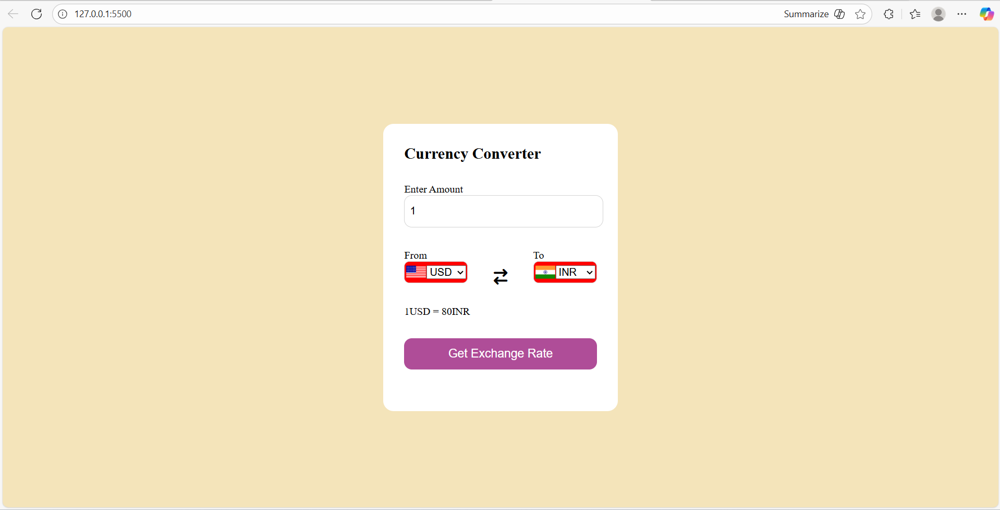

# 🌍 Currency Converter

A simple and responsive **Currency Converter Web App** built using **HTML, CSS, and JavaScript**.  
It allows users to convert currencies in real-time with a clean and user-friendly interface.

---

## 🚀 Features
- Enter any amount to convert
- Select currencies from dropdown menus
- Displays conversion rate between selected currencies
- Responsive design
- Simple and beginner-friendly project

---

## 🛠️ Technologies Used
- **HTML5** – Structure of the app  
- **CSS3** – Styling and layout  
- **JavaScript (Vanilla JS)** – Functionality and API handling  
- **Flags API** – For displaying country flags in dropdowns  

---

## 📷 Screenshots
  

---

## ⚡ How to Run
1. Clone the repository:
   ```bash
   git clone https://github.com/Siddheshwar4141/currency-converter.git
